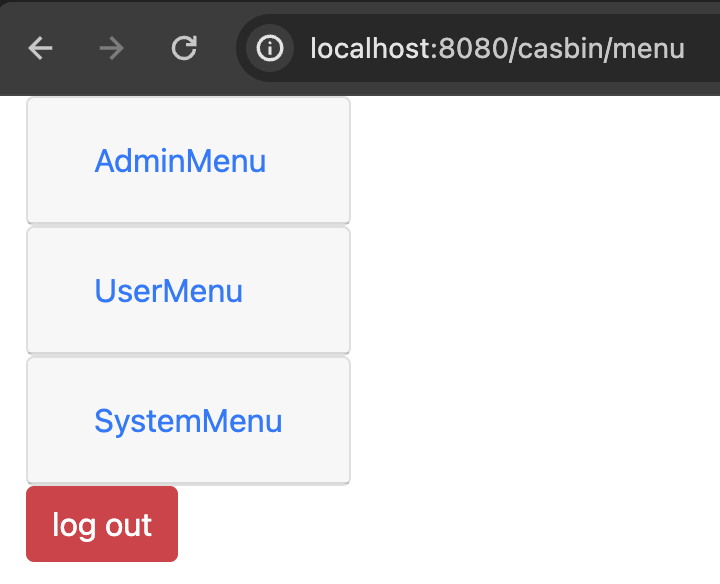
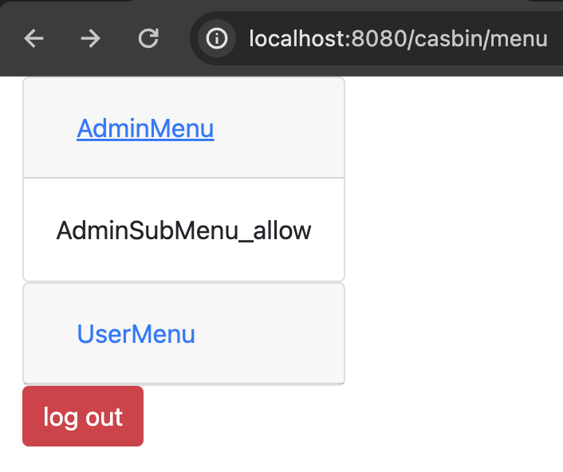

# jcasbin-menu-permission

## Introduction
This document presents an example of dynamic permission menu loading based on jCasbin. Through jCasbin, you can easily manage menu permissions in Spring Boot development.

## Project Overview

**Technology Stack**

- **Backend:** Spring Boot 3.x + jCasbin + Spring Data JPA
- **Frontend:** Bootstrap + Thymeleaf

**Startup Instructions**

1. Build the menu structure you need in the `casbin/policy.csv` file. Specifically, `g2` represents the relationship between menus. For example: `g2, submenu name, parent menu name`.
2. Once the configuration is complete, run the `main` method in `Application.java` located under `org/casbin/`. Access `http://localhost:8080/casbin/menu` for testing. 
3. The access control model file for jCasbin is located at `casbin/model.conf`, and the policy file is at `casbin/policy.csv`. Modify them as needed based on your requirements.

## Simple Examples

**Demonstration video**

<video width="640" height="480" controls>
  <source src="examples/example.mp4" type="video/mp4">
</video>

**System user**

**Admin user**

**Normal user**

