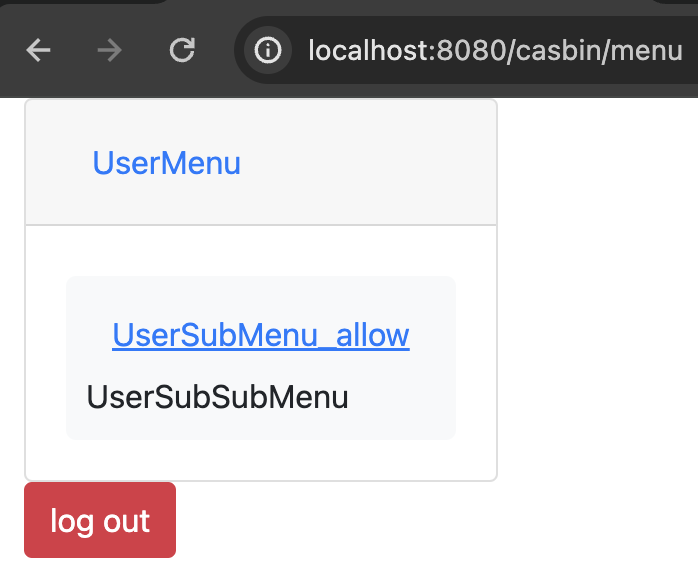

# jcasbin-menu-permission

## Introduction
This document presents an example of dynamic permission menu loading based on jCasbin. Through jCasbin, you can easily manage menu permissions in Spring Boot development.

## Project Overview

**Technology Stack**

- **Backend:** Spring Boot 2.x + jCasbin + Spring Data JPA
- **Frontend:** Tailwind CSS + Thymeleaf

**Startup Instructions**

1. Build the menu structure you need in the [`casbin/policy.csv`](https://github.com/jcasbin/jcasbin-menu-permission/blob/master/src/main/resources/casbin/policy.csv) file. Specifically, `g2` represents the relationship between menus. For example: `g2, submenu name, parent menu name`.
2. Once the configuration is complete, run the `main` method in [`Application.java`](https://github.com/jcasbin/jcasbin-menu-permission/blob/master/src/main/java/org/casbin/Application.java) located under `org/casbin/`. Access `http://localhost:8080/` for testing. 
3. The access control model file for jCasbin is located at [`casbin/model.conf`](https://github.com/jcasbin/jcasbin-menu-permission/blob/master/src/main/resources/casbin/model.conf), and the policy file is at [`casbin/policy.csv`](https://github.com/jcasbin/jcasbin-menu-permission/blob/master/src/main/resources/casbin/policy.csv). Modify them as needed based on your requirements.

## Simple Examples

**Demonstration video**

**Root user**

**Admin user**

**Normal user**

